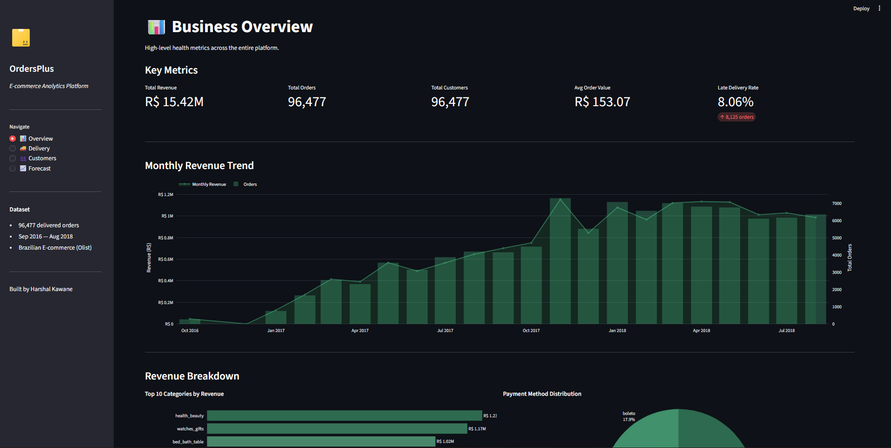
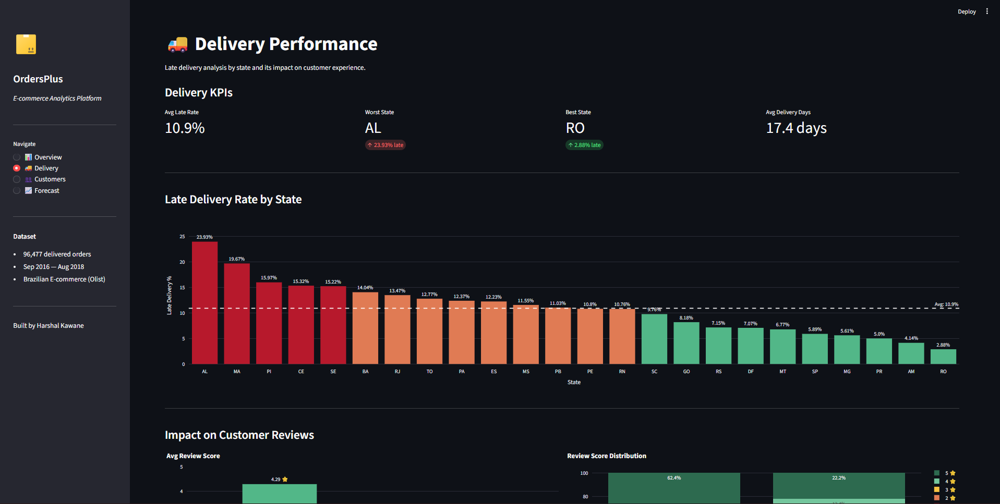
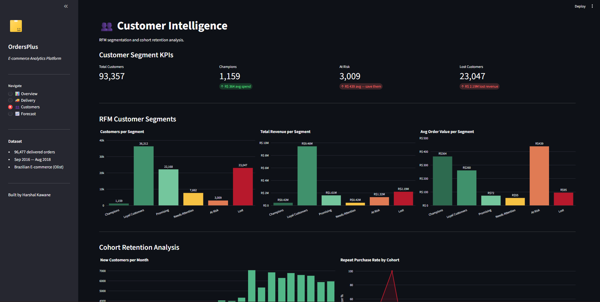
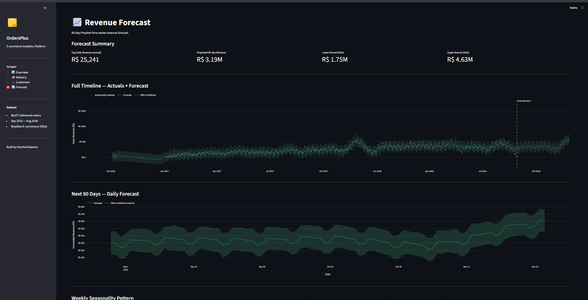

# 📦 OrdersPlus — E-Commerce Analytics Platform

> An end-to-end data analytics platform built on 100,000+ real Brazilian e-commerce transactions —
> covering the full pipeline from raw data ingestion to interactive business intelligence dashboard
> and 90-day revenue forecasting.


---

## 🎯 Business Problem

E-commerce companies lose revenue through three silent killers:
late deliveries that destroy customer trust, high-value customers
silently churning before anyone notices, and no visibility into
future revenue to plan inventory and marketing spend.

**OrdersPlus answers three questions a real e-commerce business
pays analysts to answer every week:**

1. Which customer segments are at risk of churning — and what is their revenue value?
2. Which states have critical delivery failures — and how does that impact review scores?
3. What will revenue look like over the next 90 days?

---

## 📊 Key Findings

| Finding | Metric | Business Impact |
|---|---|---|
| Late delivery destroys reviews | 2.57★ vs 4.29★ | 46.2% of late orders get 1★ — 7x higher than on-time |
| Retention crisis | 92% never return | 23,047 customers already lost — R$ 2.19M gone |
| High-value churn risk | 3,009 At Risk customers | Avg spend R$ 439 — highest of all segments |
| Delivery hotspot | AL state — 23.93% late | vs RO state — 2.88% late |
| Revenue forecast | R$ 3.19M next 90 days | +40% driven by Black Friday seasonality |
| Credit card dominance | 78.3% of revenue | Avg 3.51 installments — typical Brazilian behaviour |

---

## 🏗️ Architecture

Raw Data (Kaggle CSVs)
│
▼
┌─────────────────────┐
│  01_data_profiler   │  ← Quality report on all 9 tables
│  .py                │    Nulls, duplicates, dtypes, row counts
└────────┬────────────┘
│
▼
┌─────────────────────┐
│  02_data_cleaner    │  ← Documented cleaning decisions
│  .py                │    Audit log saved to docs/
└────────┬────────────┘
│
▼
┌─────────────────────┐
│  03_db_setup.py     │  ← Star schema MySQL database
│                     │    5-table relational model + FK constraints
└────────┬────────────┘
│
▼
┌─────────────────────┐
│  SQL Analysis       │  ← 10 business queries
│  analysis_          │    CTEs, Window Functions, LAG, RANK,
│  queries.sql        │    NTILE, DATEDIFF, cohort analysis
└────────┬────────────┘
│
▼
┌─────────────────────┐
│  01_EDA.ipynb       │  ← 9 production charts
│                     │    RFM segmentation, cohort retention,
│                     │    Prophet 90-day forecasting
└────────┬────────────┘
│
▼
┌─────────────────────┐
│  Streamlit          │  ← 4-page interactive dashboard
│  Dashboard          │    Overview │ Delivery │ Customers │ Forecast
└─────────────────────┘


---

## 📈 Dashboard Preview

### 📊 Business Overview


### 🚚 Delivery Performance


### 👥 Customer Intelligence


### 📈 Revenue Forecast


---

## 🔍 Analysis Highlights

### Late Delivery Impact
Late deliveries score **2.57★** vs **4.29★** for on-time orders.
**46.2%** of late orders receive a 1★ review — 7x higher than
on-time orders (6.6%). States AL (23.93%), MA (19.67%), and PI
(15.97%) require urgent logistics intervention.

### RFM Customer Segmentation
93,357 customers segmented using Recency, Frequency, and Monetary
scoring via SQL NTILE window functions:

| Segment | Customers | Avg Spend | Total Revenue |
|---|---|---|---|
| Champions | 1,159 | R$ 364 | R$ 421,936 |
| Loyal Customers | 36,312 | R$ 260 | R$ 9,456,285 |
| Promising | 22,168 | R$ 73 | R$ 1,607,263 |
| Needs Attention | 7,662 | R$ 55 | R$ 424,847 |
| At Risk | 3,009 | R$ 439 | R$ 1,321,913 |
| Lost | 23,047 | R$ 95 | R$ 2,190,217 |

### Cohort Retention
Average repeat purchase rate of **8.02%** across all cohorts —
meaning **92% of customers never make a second purchase**.
The business is entirely dependent on new customer acquisition.
A retention campaign targeting the At Risk segment (R$ 439 avg spend)
would yield the highest ROI.

### Prophet Forecasting
Trained on **611 days** of daily revenue data. Model detected:
- **Weekly seasonality** — Monday peak, Saturday/Sunday trough
- **Yearly seasonality** — Black Friday 2017 spike learned and
  projected into November 2018
- **90-day projection** — R$ 3.19M (95% CI: R$ 1.75M — R$ 4.62M)

---

## 🛠️ Tech Stack

| Layer | Tools |
|---|---|
| Language | Python 3.11 |
| Data Cleaning | Pandas, NumPy |
| Database | MySQL 8.0, SQLAlchemy, PyMySQL |
| SQL | CTEs, Window Functions, LAG, RANK, NTILE |
| Analysis | Jupyter Notebook |
| Forecasting | Facebook Prophet |
| Visualisation | Matplotlib, Seaborn, Plotly |
| Dashboard | Streamlit |
| Version Control | Git, GitHub |

---

## 📁 Project Structure

OrdersPlus/
├── data/
│   ├── raw/              ← original CSVs (excluded from Git)
│   └── processed/        ← cleaned CSVs (excluded from Git)
├── scripts/
│   ├── 01_data_profiler.py   ← quality report generator
│   ├── 02_data_cleaner.py    ← cleaning pipeline with audit log
│   └── 03_db_setup.py        ← database creation + data loader
├── sql/
│   └── analysis_queries.sql  ← 10 business intelligence queries
├── notebooks/
│   └── 01_EDA.ipynb          ← full exploratory analysis + forecasting
├── dashboard/
│   └── app.py                ← 4-page Streamlit application
├── docs/
│   ├── profiling_report.txt  ← data quality audit
│   ├── cleaning_log.txt      ← cleaning decisions log
│   └── *.png                 ← all charts and dashboard screenshots
├── .env                      ← credentials (excluded from Git)
├── .gitignore
├── requirements.txt
└── README.md

---

## 🚀 How to Run Locally

**1. Clone the repository**
```bash
git clone https://github.com/YourUsername/OrdersPlus.git
cd OrdersPlus
```

**2. Create virtual environment**
```bash
python -m venv venv
venv\Scripts\activate        # Windows
pip install -r requirements.txt
```

**3. Download the dataset**

Download from Kaggle:
👉 https://www.kaggle.com/datasets/olistbr/brazilian-ecommerce

Place all 9 CSV files in `data/raw/`

**4. Configure database**

Create a `.env` file in the root folder: